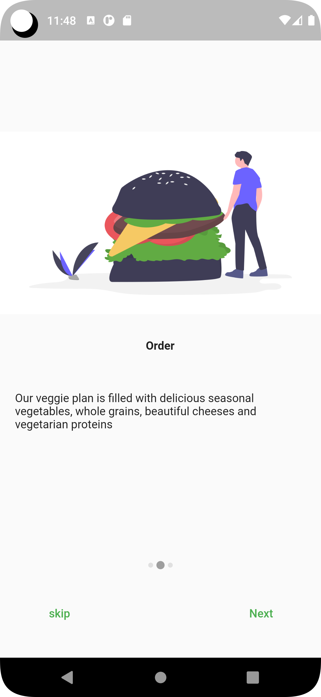

# flutter_onboard
flutter onboard screen view without package examples. if you want clone or fork.

## FrameWork
1. Flutter

## Language:
1. Dart

## Tools:
1. Git
2. Android studio / Vscode

## Pre-requirement:
1. Flutter 3.3.10
2. Dart 2.18.6

# Cli command
## check your flutter depencancy info:
```
flutter doctor
```

## Run methods:
```
flutter run
```

### ✌&ensp;Preview

|               Page1 Preview             |             page2 Preview           |          page3 Preview           |
| :----------------------------------: | :----------------------------------: | :----------------------------------: |
|   | ||

